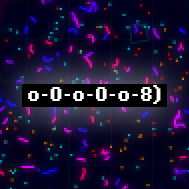

# worm 🐍



A slither.io-like game made in javascript with the canvas API.

## Controls

```A``` - Turn the player snake left.

```D``` - Turn the player snake right.

```M``` - Toggle minimap overlay.

```G``` - Toggle graphics performance mode.

```(COMMA)``` - Slow down the global time scale of the game.

```(DOT)``` - Speed up the global time scale of the game.

```(LEFT MOUSE)``` - Cycle the camera to the previous worm.

```(RIGHT MOUSE)``` - Cycle the camera to the next worm.

## Designed features

When a worm eats a food particle, the tail grows slowly in length.

The worms blink randomly from time to time.

When worms are closer to each other, they become happier.

When worms pass over the end of the map, they die and change appearance.

## Algorithm

| Node Number | Node Order | Node Significance |
| ----------- | ---------- | ----------------- |
| 0           | First      | Head              |
| 1           | Second     | Body              |
| 2           | Third      | Body              |
| 3           | Fourth     | Body              |
| 4           | Fifth      | Body              |

Derivative (second) of rotation of ```Node Number``` ```0``` is either controlled by player input or an AI algorithm.

```Node Number``` ```0``` moves with a certain speed in the direction of the worm.

```Node Number``` ```n + 1``` moves in the relative direction of ```Node Number``` ```n``` while keeping a constant distance and where ```n``` is any valid ```Node Number``` except ```0```.

## Challenges

Preventing the nodes from getting too close together and forming a knot after turning for a while.

Maintaining a playable framerate which was solved by rendering objects only that are close to the camera and those that are visible on the minimap.
